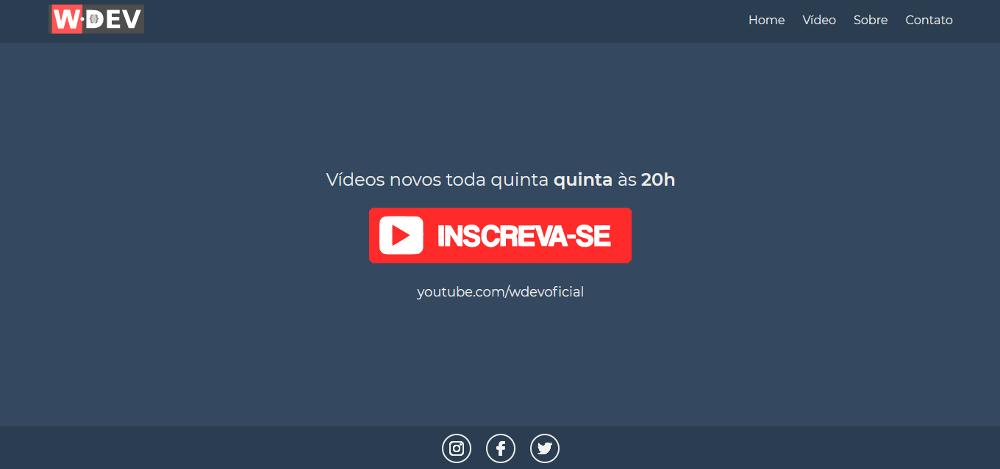

<h1 align="center">
  
</h1>




## Aplicação

Aplicação Web desenvolvida em VueJS. Clone UI Site do Canal WDEV!

 ## Tecnologias
- VueJS
- Vue-Router
- Axios

## Executando o projeto

Utilize o **yarn** ou o **npm install** para instalar as dependências do projeto.
Em seguida, inicie o projeto.

```
yarn serve
```

### **Projeto desenvolvido por**
[](https://www.linkedin.com/in/joilsonmslopes/)